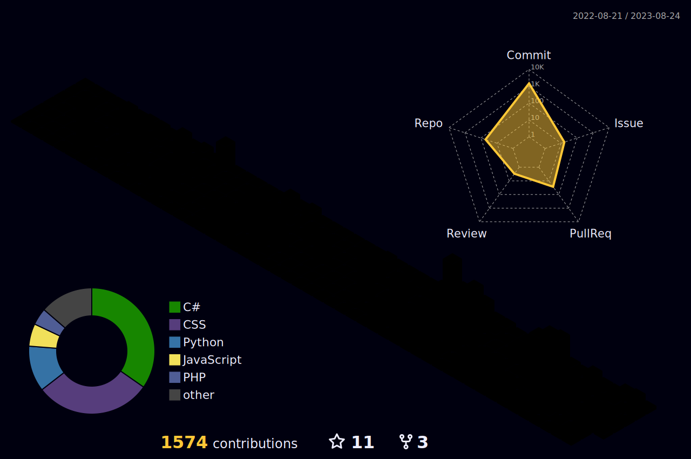

<br>

```javascript

/** 다양한 프로젝트를 만드는 `BackGwa` 입니다!
 * I am `BackGwa`, creating various projects! */

function greeting(UserID){
    console.log(`Hello, ${UserID}`);
}

greeting('everyone!');

```

<br>

---

<br>

<div align="center">

### 🔧 <b>Tech Stack</b> 🔧

   <br>    <br>

   <br>

  

</div><br>

---

<br>

