<!-- 깃허브 메트릭 -->

<!-- 인삿말 -->
### 👋 모두 반가워요,
저는 풀스택 · 머신비전 개발자 `강찬영` 이랍니다.  
주로 `BACKGWA`라는 활동명을 사용하고 있어요.

 

<!-- 수상 경력 -->
🏆 **LG CNS** AI 지니어스 아카데미 2024 <i>최우수상 : NEOEYES</i>  
🏆 **전국 마이스터고등학교 제전** 2024 <i>대상 : [FlexFlow](https://github.com/BackGwa/2024ESWContest_free_1093)</i>

 

<!-- 경험 -->
💼 **주식회사 AMS**, [입사 대기] <i>2025 - </i>  
💼 **주식회사 키웍스**, 기업부설연구소 연구원 <i>2024 - 2025</i>  
🛠️ **아산스마트팩토리마이스터고**, 메이킹 동아리 PLAYLABS <i>2023 - 2025</i>  
🎓 **아산스마트팩토리마이스터고**, 스마트팩토리과 <i>2022 - 2025</i>  
 <!-- 📖 제가 궁금해지셨다면, [이 곳]()을 눌러보세요! -->

  

